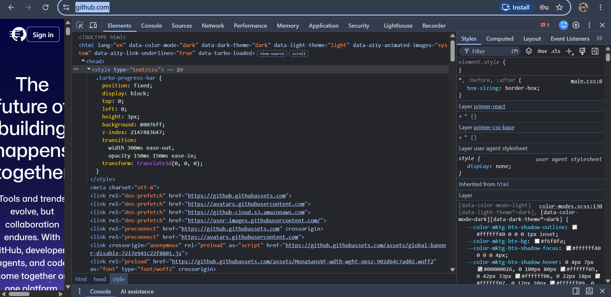

# Task 1.2 questions
## Website 1
1. What HTML tags are used on this page?

**Answer:**
```html
1. <html></html>
2. <head></head>
3. <title></title>
4. <body></body>
5. <h1></h1>
6. <p></p>
7. <a></a>
```
2. What is the page title?

**Answer:**
Example Domain

3. How many headings are there?

**Answer:**
Only one heading

## Website 2: [https://developer.mozilla.org](https://developer.mozilla.org)

1. Find the navigation menu — what tag is it wrapped in?

**Answer:** The navigation menu is wrapped in a `<nav>` tag. There are actually two of them:

```
1. <nav class="navigation"> — the outer header bar
2. <nav class="menu"> — the inner menu with tabs (HTML, CSS, JavaScript, etc.)
```

2. How is the search bar structured?

**Answer:** The search bar is a `<button>` element with a search icon inside it. Clicking it opens a popup where you can type your query.

```html
<button class="mdn-search-button" title="Search the site">
  <!-- search icon -->
</button>
```

3. What happens when you hover over links (check the styles)?

**Answer:** When you hover over a link or button, the background color changes to a slightly darker/lighter shade. This is controlled by the CSS `:hover` selector:

```css
.mdn-search-button:hover {
  background-color: var(--color-background-secondary);
}
```

## Website 3: [https://github.com](https://github.com)

1. Identify 5 different HTML elements

**Answer:**

```
1. <header>  — holds the navigation bar at the top of the page
2. <nav>     — contains the menu links (Platform, Solutions, Pricing, etc.)
3. <form>    — the email sign-up form ("Enter your email / Sign up for GitHub")
4. <footer>  — the bottom section with links to About, Terms, Privacy, etc.
5. <input>   — the email text field inside the sign-up form
```

2. Find a form element and list its inputs

**Answer:** GitHub has a sign-up form on the homepage:

```html
<form>
  <input type="email" placeholder="Enter your email" />
  <button type="submit">Sign up for GitHub</button>
</form>
```

Inputs found:
- `type="email"` — where you type your email address
- `type="submit"` (button) — to submit and create your account

3. Take a screenshot of the Elements panel

**Answer:**


